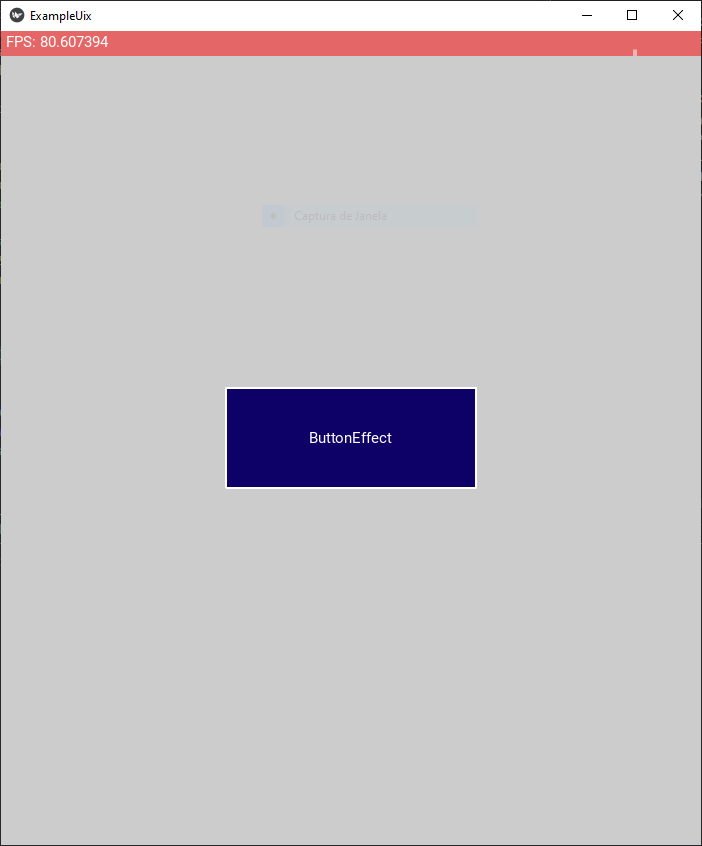

KivyGO UIX DOC
<br><br>


<br><br>

---

<details>
<summary>AnchorLayout</summary>
<ul>

## `kivygo/uix/anchorlayout.py`
### `examples/anchorlayout_example.py`

Layout que permite ancorar um widget em qualquer um dos quatro cantos ou no centro. Os widgets filhos são esticados para preencher todo o espaço restante.

<div>


<!-- Need to have 21 lines for a image with 407 of height-->
```python
ColoredAnchorLayout:
  anchor_y: "center"
  anchor_x: "center"
  background_color: [1, 1, 1, 0.8]
  ButtonEffect:
    size_hint: None, None
    size: "250dp", "100dp"
    text: "ButtonEffect"


```
</div>

|[Click to the Source Code](https://github.com/Heitor-Tasso/kivygo/blob/main/kivygo/uix/anchorlayout.py)|
|---|

</ul>
</details>

---

<details>
<summary>AndroidTabs</summary>
<ul>

## `kivygo/uix/androidtabs.py`
### `examples/androidtab_example.py`

Layout que permite ancorar um widget em qualquer um dos quatro cantos ou no centro. Os widgets filhos são esticados para preencher todo o espaço restante.

<div>


<!-- Need to have 21 lines for a image with 407 of height-->
```python
<AndroidTabsBar>:
  background_color: hex('#03A9F4')

<ExampleTab>:
  ButtonEffect:
    text: root.text


class ExampleTab(BoxLayout, AndroidTabsBase): pass

def build(self):
  android_tabs = AndroidTabs()
  for n in range(1, 6):
    tab = ExampleTab(text=f'TAB {n}')
	android_tabs.add_widget(tab)

  return android_tabs


```
</div>

|[Click to the Source Code](https://github.com/Heitor-Tasso/kivygo/blob/main/kivygo/uix/androidtabs.py)|
|---|

</ul>
</details>

---

<details>
<summary>Bezier</summary>
<ul>

## `kivygo/uix/bezier.py`
### `examples/bezier_canvas_example.py`

Layout que permite ancorar um widget em qualquer um dos quatro cantos ou no centro. Os widgets filhos são esticados para preencher todo o espaço restante.

<div>


<!-- Need to have 21 lines for a image with 407 of height-->
```python
<BezierCanvas>:

FloatLayout:
  BezierCanvas:


class BezierCanvas(Widget):
  def on_touch_down(self, touch):
	if super().on_touch_down(touch):
	  return True

	bezierline = BezierLine()
	bezierline.points = [touch.pos, touch.pos]
	touch.ud['selected'] = 1
	touch.grab(bezierline)
	self.add_widget(bezierline)
	return True


```
</div>

|[Click to the Source Code](https://github.com/Heitor-Tasso/kivygo/blob/main/kivygo/uix/bezier.py)|
|---|

</ul>
</details>

---

<details>
<summary>BoxLayout</summary>
<ul>

## `kivygo/uix/boxlayout.py`
### `examples/anchorlayout_example.py`

Layout que permite ancorar um widget em qualquer um dos quatro cantos ou no centro. Os widgets filhos são esticados para preencher todo o espaço restante.

<div>


<!-- Need to have 21 lines for a image with 407 of height-->
```python
ColoredBoxLayout:
  orientation: 'vertical'
  background_color: [1, 1, 1, 0.8]
  padding: "40dp"

  ButtonEffect:
	size_hint_y: None
	height: "300dp"
	text: "ButtonEffect"

  ColoredBoxLayout:
	background_color: [0, 1, 0, 1]
	padding: "40dp"
	ButtonEffect:
	  text: 'Effect 1'
	ButtonEffect:
	  text: 'Effect 2'


```
</div>

|[Click to the Source Code](https://github.com/Heitor-Tasso/kivygo/blob/main/kivygo/uix/boxlayout.py)|
|---|

</ul>
</details>

---

<details>
<summary>Button</summary>
<ul>

## `kivygo/uix/button.py`
### `examples/button_example.py`

Layout que permite ancorar um widget em qualquer um dos quatro cantos ou no centro. Os widgets filhos são esticados para preencher todo o espaço restante.

<div>


<!-- Need to have 21 lines for a image with 407 of height-->
```python
ColoredGridLayout:
  background_color: [1, 1, 1, 0.8]
  padding: "70dp"
  spacing: '30dp'
  rows: 3
  ButtonEffect:
	text: "Normal Rectangle Button"
	background_color: [[0.1, 0.4, 0.1, 1], [0.1, 0.4, 0.7, 1]]
  ButtonEffect:
	text: "Normal Rounded Button"
	radius: [dp(50)] * 4
	radius_effect: self.radius
	background_color: [[0.1, 0.4, 0.1, 1], [0.1, 0.4, 0.7, 1]]
  ToggleButtonEffect:
	text: "Toggle Rectangle Button"
	group: "toggle"
	down_background_color: [[0.3, 0.1, 0.7, 1], [0.7, 0.3, 0.5, 1]]
  ToggleButtonEffect:
	text: "Toggle Rounded Button"
	group: "toggle"
	down_background_color: [[0.3, 0.1, 0.7, 1], [0.7, 0.3, 0.5, 1]]
```
</div>

|[Click to the Source Code](https://github.com/Heitor-Tasso/kivygo/blob/main/kivygo/uix/button.py)|
|---|

</ul>
</details>

---

<details>
<summary>Camera</summary>
<ul>

## `kivygo/uix/camera.py`
### `examples/camera_example.py`

Layout que permite ancorar um widget em qualquer um dos quatro cantos ou no centro. Os widgets filhos são esticados para preencher todo o espaço restante.

<div>


<!-- Need to have 21 lines for a image with 407 of height-->
```python
GridLayout:
	size_hint_y: None
	height: self.minimum_height

	canvas:
		Color:
			rgba: app.theme_cls.primary_color
		Rectangle:
			pos: self.pos
			size: self.size


```
</div>

|[Click to the Source Code](https://github.com/Heitor-Tasso/kivygo/blob/main/kivygo/uix/camera.py)|
|---|

</ul>
</details>

---


<details>
<summary>CircularBar</summary>
<ul>

## `kivygo/uix/circular_bar.py`
### `examples/ciruclar_bar_example.py`

Layout que permite ancorar um widget em qualquer um dos quatro cantos ou no centro. Os widgets filhos são esticados para preencher todo o espaço restante.

<div>


<!-- Need to have 21 lines for a image with 407 of height-->
```python
ColoredBoxLayout
  orientation: 'vertical'
  padding: "80dp"
  spacing: "40dp"
  background_color: hex('#03A9F4')
  on_kv_post: Animation(progress=bar.max_progress, d=4).start(bar)
  BoxLayout:
	CircularProgressBar:
	  max_progress: 200
	  min_progress: 10
	  cap_precision: 100
	  label_text: "Ola mundo"
	CircularProgressBar:
	  id: bar
	  cap_style: "square"
	  border_width: 5
	  progress_color: [0.8, 0.8, 0.5, 1]
	  cap_precision: 50
	  widget_size: dp(100)
	  label_args: [round(self.progress)]
	  label: Label(text="Loading...\\n{}%", font_size=10, halign="center")
	  label_color: [1, 0, 0, 1]
```
</div>

|[Click to the Source Code](https://github.com/Heitor-Tasso/kivygo/blob/main/kivygo/uix/circular_bar.py)|
|---|

</ul>
</details>

---

<details>
<summary>CircularDateTimePicker</summary>
<ul>

## `kivygo\uix\circulardatetimepicker.py`
### `examples\anchorlayout_example.py`

Layout que permite ancorar um widget em qualquer um dos quatro cantos ou no centro. Os widgets filhos são esticados para preencher todo o espaço restante.

<div>


<!-- Need to have 21 lines for a image with 407 of height-->
```python
GridLayout:
	size_hint_y: None
	height: self.minimum_height

	canvas:
		Color:
			rgba: app.theme_cls.primary_color
		Rectangle:
			pos: self.pos
			size: self.size


```
</div>

|[Click to the Source Code](https://github.com/Heitor-Tasso/kivygo/blob/main/kivygo/uix/anchorlayout.py)|
|---|

</ul>
</details>

---

<details>
<summary>CircularLayout</summary>
<ul>

## `kivygo\uix\circularlayout.py`
### `examples\anchorlayout_example.py`

Layout que permite ancorar um widget em qualquer um dos quatro cantos ou no centro. Os widgets filhos são esticados para preencher todo o espaço restante.

<div>


<!-- Need to have 21 lines for a image with 407 of height-->
```python
GridLayout:
	size_hint_y: None
	height: self.minimum_height

	canvas:
		Color:
			rgba: app.theme_cls.primary_color
		Rectangle:
			pos: self.pos
			size: self.size


```
</div>

|[Click to the Source Code](https://github.com/Heitor-Tasso/kivygo/blob/main/kivygo/uix/anchorlayout.py)|
|---|

</ul>
</details>

---

<details>
<summary>CodeInput</summary>
<ul>

## `kivygo\uix\codeinput.py`
### `examples\anchorlayout_example.py`

Layout que permite ancorar um widget em qualquer um dos quatro cantos ou no centro. Os widgets filhos são esticados para preencher todo o espaço restante.

<div>


<!-- Need to have 21 lines for a image with 407 of height-->
```python
GridLayout:
	size_hint_y: None
	height: self.minimum_height

	canvas:
		Color:
			rgba: app.theme_cls.primary_color
		Rectangle:
			pos: self.pos
			size: self.size


```
</div>

|[Click to the Source Code](https://github.com/Heitor-Tasso/kivygo/blob/main/kivygo/uix/anchorlayout.py)|
|---|

</ul>
</details>

---

<details>
<summary>CurveLayout</summary>
<ul>

## `kivygo\uix\curvelayout.py`
### `examples\anchorlayout_example.py`

Layout que permite ancorar um widget em qualquer um dos quatro cantos ou no centro. Os widgets filhos são esticados para preencher todo o espaço restante.

<div>


<!-- Need to have 21 lines for a image with 407 of height-->
```python
GridLayout:
	size_hint_y: None
	height: self.minimum_height

	canvas:
		Color:
			rgba: app.theme_cls.primary_color
		Rectangle:
			pos: self.pos
			size: self.size


```
</div>

|[Click to the Source Code](https://github.com/Heitor-Tasso/kivygo/blob/main/kivygo/uix/anchorlayout.py)|
|---|

</ul>
</details>

---

<details>
<summary>Effect</summary>
<ul>

## `kivygo\uix\effect.py`
### `examples\anchorlayout_example.py`

Layout que permite ancorar um widget em qualquer um dos quatro cantos ou no centro. Os widgets filhos são esticados para preencher todo o espaço restante.

<div>


<!-- Need to have 21 lines for a image with 407 of height-->
```python
GridLayout:
	size_hint_y: None
	height: self.minimum_height

	canvas:
		Color:
			rgba: app.theme_cls.primary_color
		Rectangle:
			pos: self.pos
			size: self.size


```
</div>

|[Click to the Source Code](https://github.com/Heitor-Tasso/kivygo/blob/main/kivygo/uix/anchorlayout.py)|
|---|

</ul>
</details>

---

<details>
<summary>FloatLayout</summary>
<ul>

## `kivygo\uix\floatlayout.py`
### `examples\anchorlayout_example.py`

Layout que permite ancorar um widget em qualquer um dos quatro cantos ou no centro. Os widgets filhos são esticados para preencher todo o espaço restante.

<div>


<!-- Need to have 21 lines for a image with 407 of height-->
```python
GridLayout:
	size_hint_y: None
	height: self.minimum_height

	canvas:
		Color:
			rgba: app.theme_cls.primary_color
		Rectangle:
			pos: self.pos
			size: self.size


```
</div>

|[Click to the Source Code](https://github.com/Heitor-Tasso/kivygo/blob/main/kivygo/uix/anchorlayout.py)|
|---|

</ul>
</details>

---

<details>
<summary>FrostedGlass</summary>
<ul>

## `kivygo\uix\frostedglass.py`
### `examples\frostglass_main.py`

The effect created is based on the widget/layout passed in as the background. You can control the blur size, saturation, luminosity,
overlay color, noise opacity, border radius and the outline (color and width).

<div>


<!-- Need to have 21 lines for a image with 407 of height-->
```python
Image:
	id: bg_image
	pos_hint: {'center_x': 0.5, 'center_y': 0.5}
	source: 'FrostedgGlass_overview.png'

FrostedGlass:
	pos_hint: {'center_x': 0.5, 'center_y': 0.5}
	size_hint: (None, None)
	size: (180, 130)
	background: bg_image
	blur_size: 20
	saturation: 1.0
	luminosity: 1.5
	overlay_color: "#FFB9008C"
	noise_opacity: 0.15
	border_radius:  dp(0), dp(100), dp(0), dp(100)
	outline_color: "#000000"
	outline_width: 1.2


```
</div>

|[Click to the Source Code](https://github.com/Heitor-Tasso/kivygo/blob/main/kivygo/uix/anchorlayout.py)|
|---|

</ul>
</details>

---

<details>
<summary>Gradient</summary>
<ul>

## `kivygo\uix\gradient.py`
### `examples\anchorlayout_example.py`

Layout que permite ancorar um widget em qualquer um dos quatro cantos ou no centro. Os widgets filhos são esticados para preencher todo o espaço restante.

<div>


<!-- Need to have 21 lines for a image with 407 of height-->
```python
GridLayout:
	size_hint_y: None
	height: self.minimum_height

	canvas:
		Color:
			rgba: app.theme_cls.primary_color
		Rectangle:
			pos: self.pos
			size: self.size


```
</div>

|[Click to the Source Code](https://github.com/Heitor-Tasso/kivygo/blob/main/kivygo/uix/anchorlayout.py)|
|---|

</ul>
</details>

---

<details>
<summary>GridLayout</summary>
<ul>

## `kivygo\uix\gridlayout.py`
### `examples\anchorlayout_example.py`

Layout que permite ancorar um widget em qualquer um dos quatro cantos ou no centro. Os widgets filhos são esticados para preencher todo o espaço restante.

<div>


<!-- Need to have 21 lines for a image with 407 of height-->
```python
GridLayout:
	size_hint_y: None
	height: self.minimum_height

	canvas:
		Color:
			rgba: app.theme_cls.primary_color
		Rectangle:
			pos: self.pos
			size: self.size


```
</div>

|[Click to the Source Code](https://github.com/Heitor-Tasso/kivygo/blob/main/kivygo/uix/anchorlayout.py)|
|---|

</ul>
</details>

---

<details>
<summary>Icon</summary>
<ul>

## `kivygo\uix\icon.py`
### `examples\anchorlayout_example.py`

Layout que permite ancorar um widget em qualquer um dos quatro cantos ou no centro. Os widgets filhos são esticados para preencher todo o espaço restante.

<div>


<!-- Need to have 21 lines for a image with 407 of height-->
```python
GridLayout:
	size_hint_y: None
	height: self.minimum_height

	canvas:
		Color:
			rgba: app.theme_cls.primary_color
		Rectangle:
			pos: self.pos
			size: self.size


```
</div>

|[Click to the Source Code](https://github.com/Heitor-Tasso/kivygo/blob/main/kivygo/uix/anchorlayout.py)|
|---|

</ul>
</details>

---

<details>
<summary>Image</summary>
<ul>

## `kivygo\uix\image.py`
### `examples\anchorlayout_example.py`

Layout que permite ancorar um widget em qualquer um dos quatro cantos ou no centro. Os widgets filhos são esticados para preencher todo o espaço restante.

<div>


<!-- Need to have 21 lines for a image with 407 of height-->
```python
GridLayout:
	size_hint_y: None
	height: self.minimum_height

	canvas:
		Color:
			rgba: app.theme_cls.primary_color
		Rectangle:
			pos: self.pos
			size: self.size


```
</div>

|[Click to the Source Code](https://github.com/Heitor-Tasso/kivygo/blob/main/kivygo/uix/anchorlayout.py)|
|---|

</ul>
</details>

---

<details>
<summary>Input</summary>
<ul>

## `kivygo\uix\input.py`
### `examples\anchorlayout_example.py`

Layout que permite ancorar um widget em qualquer um dos quatro cantos ou no centro. Os widgets filhos são esticados para preencher todo o espaço restante.

<div>


<!-- Need to have 21 lines for a image with 407 of height-->
```python
GridLayout:
	size_hint_y: None
	height: self.minimum_height

	canvas:
		Color:
			rgba: app.theme_cls.primary_color
		Rectangle:
			pos: self.pos
			size: self.size


```
</div>

|[Click to the Source Code](https://github.com/Heitor-Tasso/kivygo/blob/main/kivygo/uix/anchorlayout.py)|
|---|

</ul>
</details>

---

<details>
<summary>Joystick</summary>
<ul>

## `kivygo\uix\joystick.py`
### `examples\anchorlayout_example.py`

Layout que permite ancorar um widget em qualquer um dos quatro cantos ou no centro. Os widgets filhos são esticados para preencher todo o espaço restante.

<div>


<!-- Need to have 21 lines for a image with 407 of height-->
```python
GridLayout:
	size_hint_y: None
	height: self.minimum_height

	canvas:
		Color:
			rgba: app.theme_cls.primary_color
		Rectangle:
			pos: self.pos
			size: self.size


```
</div>

|[Click to the Source Code](https://github.com/Heitor-Tasso/kivygo/blob/main/kivygo/uix/anchorlayout.py)|
|---|

</ul>
</details>

---

<details>
<summary>KivygIcon</summary>
<ul>

## `kivygo\uix\kivyg_icon.py`
### `examples\anchorlayout_example.py`

Layout que permite ancorar um widget em qualquer um dos quatro cantos ou no centro. Os widgets filhos são esticados para preencher todo o espaço restante.

<div>


<!-- Need to have 21 lines for a image with 407 of height-->
```python
GridLayout:
	size_hint_y: None
	height: self.minimum_height

	canvas:
		Color:
			rgba: app.theme_cls.primary_color
		Rectangle:
			pos: self.pos
			size: self.size


```
</div>

|[Click to the Source Code](https://github.com/Heitor-Tasso/kivygo/blob/main/kivygo/uix/anchorlayout.py)|
|---|

</ul>
</details>

---

<details>
<summary>Label</summary>
<ul>

## `kivygo\uix\label.py`
### `examples\anchorlayout_example.py`

Layout que permite ancorar um widget em qualquer um dos quatro cantos ou no centro. Os widgets filhos são esticados para preencher todo o espaço restante.

<div>


<!-- Need to have 21 lines for a image with 407 of height-->
```python
GridLayout:
	size_hint_y: None
	height: self.minimum_height

	canvas:
		Color:
			rgba: app.theme_cls.primary_color
		Rectangle:
			pos: self.pos
			size: self.size


```
</div>

|[Click to the Source Code](https://github.com/Heitor-Tasso/kivygo/blob/main/kivygo/uix/anchorlayout.py)|
|---|

</ul>
</details>

---

<details>
<summary>NavigationDrawer</summary>
<ul>

## `kivygo\uix\navigationdrawer.py`
### `examples\anchorlayout_example.py`

Layout que permite ancorar um widget em qualquer um dos quatro cantos ou no centro. Os widgets filhos são esticados para preencher todo o espaço restante.

<div>


<!-- Need to have 21 lines for a image with 407 of height-->
```python
GridLayout:
	size_hint_y: None
	height: self.minimum_height

	canvas:
		Color:
			rgba: app.theme_cls.primary_color
		Rectangle:
			pos: self.pos
			size: self.size


```
</div>

|[Click to the Source Code](https://github.com/Heitor-Tasso/kivygo/blob/main/kivygo/uix/anchorlayout.py)|
|---|

</ul>
</details>

---

<details>
<summary>Particle</summary>
<ul>

## `kivygo\uix\particle.py`
### `examples\anchorlayout_example.py`

Layout que permite ancorar um widget em qualquer um dos quatro cantos ou no centro. Os widgets filhos são esticados para preencher todo o espaço restante.

<div>


<!-- Need to have 21 lines for a image with 407 of height-->
```python
GridLayout:
	size_hint_y: None
	height: self.minimum_height

	canvas:
		Color:
			rgba: app.theme_cls.primary_color
		Rectangle:
			pos: self.pos
			size: self.size


```
</div>

|[Click to the Source Code](https://github.com/Heitor-Tasso/kivygo/blob/main/kivygo/uix/anchorlayout.py)|
|---|

</ul>
</details>

---

<details>
<summary>PizzaGraph</summary>
<ul>

## `kivygo\uix\pizza_graph.py`
### `examples\anchorlayout_example.py`

Layout que permite ancorar um widget em qualquer um dos quatro cantos ou no centro. Os widgets filhos são esticados para preencher todo o espaço restante.

<div>


<!-- Need to have 21 lines for a image with 407 of height-->
```python
GridLayout:
	size_hint_y: None
	height: self.minimum_height

	canvas:
		Color:
			rgba: app.theme_cls.primary_color
		Rectangle:
			pos: self.pos
			size: self.size


```
</div>

|[Click to the Source Code](https://github.com/Heitor-Tasso/kivygo/blob/main/kivygo/uix/anchorlayout.py)|
|---|

</ul>
</details>

---

<details>
<summary>Popup</summary>
<ul>

## `kivygo\uix\popup.py`
### `examples\anchorlayout_example.py`

Layout que permite ancorar um widget em qualquer um dos quatro cantos ou no centro. Os widgets filhos são esticados para preencher todo o espaço restante.

<div>


<!-- Need to have 21 lines for a image with 407 of height-->
```python
GridLayout:
	size_hint_y: None
	height: self.minimum_height

	canvas:
		Color:
			rgba: app.theme_cls.primary_color
		Rectangle:
			pos: self.pos
			size: self.size


```
</div>

|[Click to the Source Code](https://github.com/Heitor-Tasso/kivygo/blob/main/kivygo/uix/anchorlayout.py)|
|---|

</ul>
</details>

---

<details>
<summary>Progrespinner</summary>
<ul>

## `kivygo\uix\progressspinner.py`
### `examples\anchorlayout_example.py`

Layout que permite ancorar um widget em qualquer um dos quatro cantos ou no centro. Os widgets filhos são esticados para preencher todo o espaço restante.

<div>


<!-- Need to have 21 lines for a image with 407 of height-->
```python
GridLayout:
	size_hint_y: None
	height: self.minimum_height

	canvas:
		Color:
			rgba: app.theme_cls.primary_color
		Rectangle:
			pos: self.pos
			size: self.size


```
</div>

|[Click to the Source Code](https://github.com/Heitor-Tasso/kivygo/blob/main/kivygo/uix/anchorlayout.py)|
|---|

</ul>
</details>

---
<!-- ###############################################################################################
#                                         (S) RadialSlider                                         #
#################################################################################################-->
<details>
<summary>RadialSlider</summary>
<ul>

## [`kivygo\uix\radialslider.py`](https://github.com/Heitor-Tasso/kivygo/blob/main/kivygo/uix/radialslider.py)
### [`examples\radialslider_example.py`](https://github.com/Heitor-Tasso/kivygo/blob/main/examples/radialslider_example.py)

The `RadialSlider` is an angular slider widget, which acts similarly to
the kivy's native linear slider.
The RadialSlider has two components: a **track** and a **thumb**. The thumb → ●, can be dragged along the circular path of the track → ◯, with an angle
ranging from 0 to 360 degrees.

You can define the position of the **thumb** via the `angle`, the `value`, or the `normalized_value`. 
Note that these values are also automatically updated as the thumb is dragged.

<div align="center">

</div>

<br><br>


```python
RadialSlider:
  size_hint: (None, None)
  size: 200, 200
  track_color: "#DEDEDE" # gray track
  track_thickness: 15
  canvas.before:
    Color:
	  rgba: rgba("#FFFFFF")
	Ellipse:
	  size: self.size
	  pos: self.pos
  canvas:
    Color:
	  rgba: rgba("#3086BD")
	Line:
	  width: 15
	  circle: self.center_x, self.center_y, self.width/2 - 15, 0, self.angle
  Label:
    pos: self.parent.center_x - self.width/2, self.parent.center_y - self.height/2
	text: "{}%".format(int(self.parent.value))
	color: "#808080"
```

|[Click to the Source Code](https://github.com/Heitor-Tasso/kivygo/blob/main/kivygo/uix/radialslider.py)|
|---|


---

## Tips and Considerations:

### Widget size setting

The Radial Slider will adjust to the smallest size, between height and width.
Setting different sizes for the width and height is not recommended, as although the visible path and thumb will adjust to the smallest size, the widget as a whole will still conform to the size you set.

While setting the size incorrectly does not compromise the functionality of the widget itself, you might be overwriting another widget's area resulting in unexpected behavior of the other widget.

The example bellow shows the difference between the unespected behavior with wrong fitting and the correct fitting. The red area shows the real widget size.

Wrong size definition             |Wrong size definition             |  Correct size definition
:-------------------------|:-------------------------|:-------------------------
  |   |  
`size_hint: (None, None)` <br> `size: 250, 200` ❌   |`size_hint: (None, None)` <br> `size: 200, 250` ❌  | `size_hint: (None, None)` <br> `size: 200, 200` ✔️


If you want to set the size based on `size_hint`, the proper way would be:

<br>

For adjust the height to the width:
```yaml
size_hint: (your_size_hint_x, None)
height: self.width
```

<br>

Or for adjust the width to the height:
```yaml
size_hint: (None, your_size_hint_y)
width: self.height
```

<br>

Or just using the `size` property:
```yaml
size_hint: (None, None)
size: your_width, your_height # one value must be the same as the other
```

<br>

🟡 If the parent of the RadialSlider widget has equal width and height dimensions, eg: `size: (200, 200)`. You can use size `size_hint_x` and `size_hint_y` freely, **as long as you set the same value for both**, like: `size_hint:(0.5, 0.5 )`, `size_hint:(0.2, 0.2)`, etc.

---
## API

	angle

> Current angle used for the Radial Slider. You can use it for setting
> the angle of the thumb in the track in range 0 - 360.
> 
> `angle` is defaults to 0.  

<br/>

	max_value

> Maximum value allowed for the Radial Slider.
> 
> `max_value` is defaults to 1.

<br/>

	min_value

> Minimum value allowed for the Radial Slider.
> 
> `min_value` is defaults to 0.

<br/>

	thumb_color

> Color of the thumb.
> 
> `thumb_color` is defaults to '#ffffff.'''

<br/>

	thumb_diameter

> Diameter of the thumb.
> 
> `thumb_diameter` is defaults to 25.

<br/>

	track_color

> Color of the track.
> 
> `track_color` is defaults to "#ffffff".

<br/>

	track_thickness

> Thickness of the track.
> 
> `track_thickness`is defaults to 2.'''

<br/>

	value

> Normalized value inside the range (min_value - max_value). You can use
> it for setting the value betwwen the minimum and maximum value.
> 
> `value` is defaults to 0.

<br/>

	value_normalized

> Normalized value inside the range (min_value - max_value) to 0-1
> range. You can also use it for setting the real value without knowing
> the minimum and maximum value.
> 
> `value_normalized` is defaults to 0

</ul>
</details>

<!-- ###############################################################################################
#                                            (S) Rotabox                                           #
#################################################################################################-->
---

<details>
<summary>Rotabox</summary>
<ul>

## `kivygo\uix\rotabox.py`
### `examples\anchorlayout_example.py`

Layout que permite ancorar um widget em qualquer um dos quatro cantos ou no centro. Os widgets filhos são esticados para preencher todo o espaço restante.

<div>


<!-- Need to have 21 lines for a image with 407 of height-->
```python
GridLayout:
	size_hint_y: None
	height: self.minimum_height

	canvas:
		Color:
			rgba: app.theme_cls.primary_color
		Rectangle:
			pos: self.pos
			size: self.size


```
</div>

|[Click to the Source Code](https://github.com/Heitor-Tasso/kivygo/blob/main/kivygo/uix/anchorlayout.py)|
|---|

</ul>
</details>

---

<details>
<summary>ScreenManager</summary>
<ul>

## `kivygo\uix\screenmanager.py`
### `examples\anchorlayout_example.py`

Layout que permite ancorar um widget em qualquer um dos quatro cantos ou no centro. Os widgets filhos são esticados para preencher todo o espaço restante.

<div>


<!-- Need to have 21 lines for a image with 407 of height-->
```python
GridLayout:
	size_hint_y: None
	height: self.minimum_height

	canvas:
		Color:
			rgba: app.theme_cls.primary_color
		Rectangle:
			pos: self.pos
			size: self.size


```
</div>

|[Click to the Source Code](https://github.com/Heitor-Tasso/kivygo/blob/main/kivygo/uix/anchorlayout.py)|
|---|

</ul>
</details>

---

<details>
<summary>ScrollView</summary>
<ul>

## `kivygo\uix\scrollview.py`
### `examples\anchorlayout_example.py`

Layout que permite ancorar um widget em qualquer um dos quatro cantos ou no centro. Os widgets filhos são esticados para preencher todo o espaço restante.

<div>


<!-- Need to have 21 lines for a image with 407 of height-->
```python
GridLayout:
	size_hint_y: None
	height: self.minimum_height

	canvas:
		Color:
			rgba: app.theme_cls.primary_color
		Rectangle:
			pos: self.pos
			size: self.size


```
</div>

|[Click to the Source Code](https://github.com/Heitor-Tasso/kivygo/blob/main/kivygo/uix/anchorlayout.py)|
|---|

</ul>
</details>

---

<details>
<summary>Segment</summary>
<ul>

## `kivygo\uix\segment.py`
### `examples\anchorlayout_example.py`

Layout que permite ancorar um widget em qualquer um dos quatro cantos ou no centro. Os widgets filhos são esticados para preencher todo o espaço restante.

<div>


<!-- Need to have 21 lines for a image with 407 of height-->
```python
GridLayout:
	size_hint_y: None
	height: self.minimum_height

	canvas:
		Color:
			rgba: app.theme_cls.primary_color
		Rectangle:
			pos: self.pos
			size: self.size


```
</div>

|[Click to the Source Code](https://github.com/Heitor-Tasso/kivygo/blob/main/kivygo/uix/anchorlayout.py)|
|---|

</ul>
</details>

---

<details>
<summary>Shader</summary>
<ul>

## `kivygo\uix\shader.py`
### `examples\anchorlayout_example.py`

Layout que permite ancorar um widget em qualquer um dos quatro cantos ou no centro. Os widgets filhos são esticados para preencher todo o espaço restante.

<div>


<!-- Need to have 21 lines for a image with 407 of height-->
```python
GridLayout:
	size_hint_y: None
	height: self.minimum_height

	canvas:
		Color:
			rgba: app.theme_cls.primary_color
		Rectangle:
			pos: self.pos
			size: self.size


```
</div>

|[Click to the Source Code](https://github.com/Heitor-Tasso/kivygo/blob/main/kivygo/uix/anchorlayout.py)|
|---|

</ul>
</details>

---

<details>
<summary>SimpleTableLayout</summary>
<ul>

## `kivygo\uix\simpletablelayout.py`
### `examples\anchorlayout_example.py`

Layout que permite ancorar um widget em qualquer um dos quatro cantos ou no centro. Os widgets filhos são esticados para preencher todo o espaço restante.

<div>


<!-- Need to have 21 lines for a image with 407 of height-->
```python
GridLayout:
	size_hint_y: None
	height: self.minimum_height

	canvas:
		Color:
			rgba: app.theme_cls.primary_color
		Rectangle:
			pos: self.pos
			size: self.size


```
</div>

|[Click to the Source Code](https://github.com/Heitor-Tasso/kivygo/blob/main/kivygo/uix/anchorlayout.py)|
|---|

</ul>
</details>

---

<details>
<summary>Slider</summary>
<ul>

## `kivygo\uix\slider.py`
### `examples\anchorlayout_example.py`

Layout que permite ancorar um widget em qualquer um dos quatro cantos ou no centro. Os widgets filhos são esticados para preencher todo o espaço restante.

<div>


<!-- Need to have 21 lines for a image with 407 of height-->
```python
GridLayout:
	size_hint_y: None
	height: self.minimum_height

	canvas:
		Color:
			rgba: app.theme_cls.primary_color
		Rectangle:
			pos: self.pos
			size: self.size


```
</div>

|[Click to the Source Code](https://github.com/Heitor-Tasso/kivygo/blob/main/kivygo/uix/anchorlayout.py)|
|---|

</ul>
</details>

---

<details>
<summary>Table</summary>
<ul>

## `kivygo\uix\table.py`
### `examples\anchorlayout_example.py`

Layout que permite ancorar um widget em qualquer um dos quatro cantos ou no centro. Os widgets filhos são esticados para preencher todo o espaço restante.

<div>


<!-- Need to have 21 lines for a image with 407 of height-->
```python
GridLayout:
	size_hint_y: None
	height: self.minimum_height

	canvas:
		Color:
			rgba: app.theme_cls.primary_color
		Rectangle:
			pos: self.pos
			size: self.size


```
</div>

|[Click to the Source Code](https://github.com/Heitor-Tasso/kivygo/blob/main/kivygo/uix/anchorlayout.py)|
|---|

</ul>
</details>

---

<details>
<summary>TapTargetView</summary>
<ul>

## `kivygo\uix\taptargetview.py`
### `examples\anchorlayout_example.py`

Layout que permite ancorar um widget em qualquer um dos quatro cantos ou no centro. Os widgets filhos são esticados para preencher todo o espaço restante.

<div>


<!-- Need to have 21 lines for a image with 407 of height-->
```python
GridLayout:
	size_hint_y: None
	height: self.minimum_height

	canvas:
		Color:
			rgba: app.theme_cls.primary_color
		Rectangle:
			pos: self.pos
			size: self.size


```
</div>

|[Click to the Source Code](https://github.com/Heitor-Tasso/kivygo/blob/main/kivygo/uix/anchorlayout.py)|
|---|

</ul>
</details>

---

<details>
<summary>Terminal</summary>
<ul>

## `kivygo\uix\terminal.py`
### `examples\anchorlayout_example.py`

Layout que permite ancorar um widget em qualquer um dos quatro cantos ou no centro. Os widgets filhos são esticados para preencher todo o espaço restante.

<div>


<!-- Need to have 21 lines for a image with 407 of height-->
```python
GridLayout:
	size_hint_y: None
	height: self.minimum_height

	canvas:
		Color:
			rgba: app.theme_cls.primary_color
		Rectangle:
			pos: self.pos
			size: self.size


```
</div>

|[Click to the Source Code](https://github.com/Heitor-Tasso/kivygo/blob/main/kivygo/uix/anchorlayout.py)|
|---|

</ul>
</details>

---