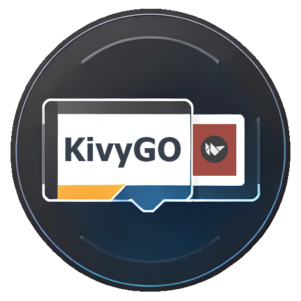

KivyGO
====

Interfaces de usuário inovadoras facilitadas.

KivyGO é um framework [Python] de plataforma cruzada de código aberto (https://www.python.org)
utilizado para o desenvolvimento de aplicações que fazem uso de tecnologias inovadoras,
interfaces de usuário com design complexo e inovador.

KivyGO é licenciado pelo MIT, para ser utilizado em um framework
chamado Kivy [Kivy Organization](https://kivy.org/#organization).

<!---Esses são exemplos. Veja https://shields.io para outras pessoas ou para personalizar este conjunto de escudos. Você pode querer incluir dependências, status do projeto e informações de licença aqui--->
#

====

### Ajustes e melhorias

O projeto ainda está em desenvolvimento e as próximas atualizações serão voltadas nas seguintes tarefas:

- [ ] Documentação Baseado na do Kivy
- [ ] Exemplo de cada Widget e funcionalidade, em Imagem/Vídeo e Código
- [ ] Definir um theme único para o framework
- [x] Adicionar todos os créditos devidos
- [ ] Refatorar todos widgets e deixá-los no padrão do framework
- [ ] Finalizar o desenvolvimento do uix/codeinput.py

## 💻 Pré-requisitos

Antes de começar, verifique se você atendeu aos seguintes requisitos:
<!---Estes são apenas requisitos de exemplo. Adicionar, duplicar ou remover conforme necessário--->
* Você instalou o `Python >= 3.9.7`.
* Você tem uma máquina `Windows / Linux / Mac / Android`.

## ☕ Utilizando o kivygo

Para usar o KivyGO, siga estas etapas:

 - Instale a lib pelo comando pip `pip install kivygo`.
 - Copie o código de exemplo da biblioteca e inicie.
 - Para fazer a instalação pelo github `pip install git+https://github.com/Heitor-Tasso/kivygo.git#egg=kivygo`.

## 📫 Contribuindo para o kivygo
<!---Se o seu README for longo ou se você tiver algum processo ou etapas específicas que deseja que os contribuidores sigam, considere a criação de um arquivo CONTRIBUTING.md separado--->
Para contribuir com o kivygo, siga estas etapas:

1. Bifurque este repositório.
2. Crie um branch: `git checkout -b dev`.
3. Faça suas alterações e confirme-as: `git commit -m '<mensagem_commit>'` | [COMMITS EXAMPLE](COMMIT.MD)
4. Envie para o branch: `git push origin dev`
5. Crie a solicitação de pull.

Como alternativa, consulte a documentação do GitHub em [como criar uma solicitação pull](https://help.github.com/en/github/collaborating-with-issues-and-pull-requests/creating-a-pull-request).

## 🤝 Colaboradores

Agradecemos às seguintes pessoas que contribuíram para este projeto:

<table>
  <tr>
    <td align="center">
      <a href="#">
         
        
          <b>Heitor Tasso</b>
        
      </a>
    </td>
  </tr>
</table>

## 📝 Licença

Esse projeto está sob licença. Veja o arquivo [LICENCE](LICENSE) para mais detalhes.
Para ver a licença dos repositórios utilizados, Veja o arquivo [LIBRARIES CREDITS](CREDITS.MD) para mais detalhes.

[⬆ Voltar ao topo](#kivygo) 
# kivygo

Para ver quantidade de linhas do código no Visual Studio Code:
 - `(gci -include *.kv,*.py -recurse | select-string .).Count`
