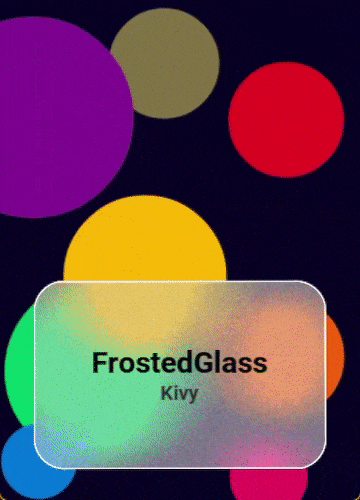

# KivyGO UIX DOC
---

## `kivygo/uix/anchorlayout.py`
### AnchorLayout

Layout que permite ancorar um widget em qualquer um dos quatro cantos ou no centro. Os widgets filhos são esticados para preencher todo o espaço restante.


<details>
<summary>AnchorLayout Centered</summary>
<ul>


```python
GridLayout:
    size_hint_y: None
    height: self.minimum_height

    canvas:
        Color:
            rgba: app.theme_cls.primary_color
        Rectangle:
            pos: self.pos
            size: self.size
```
</ul>
</details>

|[Click here](https://github.com/)|
|---|


---
